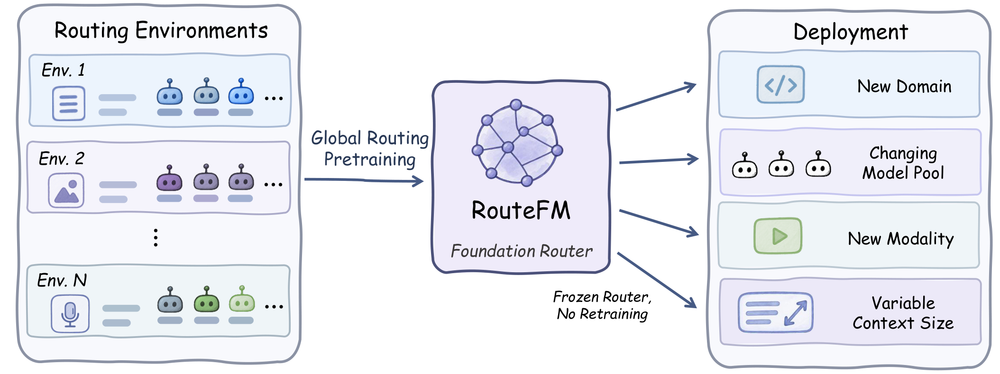
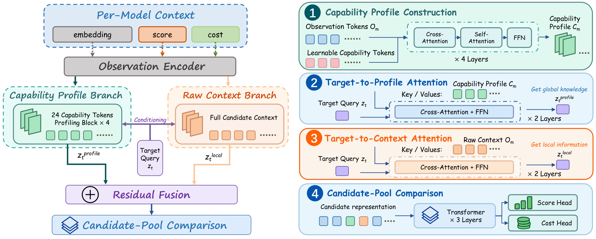

# RouteFM: Pretrain Once, Route Anywhere

> **[Pretrain Once, Route Anywhere: Towards a Foundation Model for LLM Routing](https://arxiv.org/abs/2609.37362)**<br>
> Guannan Lai and Han-Jia Ye · Nanjing University

[GitHub](https://github.com/LAMDA-Model-Reuse/RouteFM) ·
[Paper](https://arxiv.org/abs/2609.37362) ·
[PDF](https://arxiv.org/pdf/2609.37362)



RouteFM is a pretrained in-context model router. Given an anonymous candidate
pool, behavioral observations of candidate quality and relative cost, and a
new target query, it predicts the target-specific quality and relative cost of
every candidate. A frozen RouteFM adapts to new routing environments through
context alone, without target-domain parameter updates.

On MMR-Bench, which is excluded from pretraining, RouteFM outperforms the
strongest non-RouteFM baseline by **2.23 quality points** with only eight
observations per candidate.

## Model description

RouteFM turns LLM routing from repeated local fitting into global routing
pretraining. Candidate identities, providers, parameter counts, and other
explicit identity features are never exposed to the router. Instead, it:

1. builds a compact capability profile for every anonymous candidate from behavioral context;
2. retrieves complementary evidence from both the profile and the original observations for each target query;
3. compares the current pool jointly with a permutation-equivariant Transformer; and
4. predicts target-specific quality and relative cost.



The released architecture uses 24 capability tokens, hidden dimension 256,
and episodic pretraining with candidate-slot permutation. The training
objective combines point prediction, pairwise ranking, and routing regret.
See the [paper](https://arxiv.org/pdf/2609.37362) for the complete method.

## Released variants

| Variant | Compatible query encoder | Dimension | Query modality | Parameters |
| --- | --- | ---: | --- | ---: |
| RouteFM-Qwen | Qwen3-VL-Embedding-8B | 4096 | Joint text and image | 12,781,059 |
| RouteFM-BGE | BAAI/bge-base-en-v1.5, CLS pooling | 768 | Text only | 11,070,467 |

Each variant contains a canonical `model.safetensors` and `config.json`.
The `legacy/` directory contains the exact PyTorch checkpoint bytes from the
GitHub v1.0.0 release. [`manifest.json`](manifest.json) records sizes,
configurations, immutable revisions, and SHA-256 digests.
The root [`config.json`](config.json) indexes both variants and is the standard
Hugging Face query file used for repository download statistics.

The query encoders are frozen external feature extractors. They are not
included in this repository, and RouteFM is not a fine-tune of either encoder.
Users must obtain the encoders or compatible embedding services separately
and comply with their licenses and access terms.

## Usage

Install the official package directly from GitHub:

```bash
python -m pip install git+https://github.com/LAMDA-Model-Reuse/RouteFM.git
```

The package downloads the correct safetensors checkpoint from the immutable
Hub artifact revision, validates its SHA-256 digest, and stores it in the
standard Hugging Face cache.

```bash
routefm-predict --encoder qwen --input my_episode.npz \
  --output predictions.json --device cpu
```

To prefetch both released variants for offline jobs:

```bash
routefm-download --encoder all
```

The input schema, embedding instructions, observation masks, local checkpoint
overrides, and output format are documented in
[`docs/CUSTOM_DATA.md`](https://github.com/LAMDA-Model-Reuse/RouteFM/blob/v1.0.1/docs/CUSTOM_DATA.md).

## Training

Both variants were trained from random initialization in one continuous
10,000-update run. All router modules were trained jointly, while the external
query encoder remained frozen. The configured pretraining mixture is
LLMRouterBench 45%, RouterBench 25%, RouterEval 25%, and MixInstruct 5%.
MMR-Bench is not a pretraining source.

The complete data contract, source proportions, episode construction,
curriculum, and optimization commands are available in
[`docs/PRETRAINING.md`](https://github.com/LAMDA-Model-Reuse/RouteFM/blob/v1.0.1/docs/PRETRAINING.md).
Underlying third-party datasets and embedding models are not redistributed.

## Evaluation

The paper evaluates the frozen Qwen-based RouteFM on held-out RouterEval
queries and on cross-modal transfer to MMR-Bench.

| Evaluation | K=8 | K=16 | K=32 | K=64 | Large |
| --- | ---: | ---: | ---: | ---: | ---: |
| RouterEval (in-domain) | **0.6192** | **0.6433** | **0.6627** | **0.6611** | — |
| MMR-Bench (cross-modal) | **0.7323** | **0.7457** | **0.7487** | **0.7504** | **0.7614** |

These are the paper's matched-protocol results. MMR-Bench uses dataset-wise
five-fold context/target splits in the limited-observation setting and a
40%/60% split in the large-observation setting. RouteFM remains frozen and
uses no evaluation labels for parameter updates.

The GitHub release additionally publishes a fixed seed-31010 split for
artifact auditing. That split is retrospective and post-selected, differs
from the paper's five-fold protocol, and should not be compared directly with
the table above. Its exact IDs, hashes, aggregation rules, and reference
outputs are documented in
[`docs/MMRBENCH_V1.md`](https://github.com/LAMDA-Model-Reuse/RouteFM/blob/v1.0.1/docs/MMRBENCH_V1.md).

## Intended use and limitations

RouteFM is intended for research on routing among a user-supplied candidate
pool with observed context outcomes. It does not call candidate models,
generate query embeddings, or establish that a candidate is safe or suitable.

- Candidate order and embedding family must remain consistent within an episode.
- Each candidate needs at least one valid context observation.
- Predicted cost is relative, not a calibrated monetary or latency estimate.
- The default decision rule ignores predicted cost and selects maximum predicted quality.
- Performance may change across encoder revisions, languages, domains, candidate pools, and context sizes outside the training distribution.

## License

RouteFM source code and released routing weights are licensed under
Apache-2.0. Third-party assets retain their own licenses and terms; see
[`THIRD_PARTY_NOTICES.md`](https://github.com/LAMDA-Model-Reuse/RouteFM/blob/v1.0.1/THIRD_PARTY_NOTICES.md).

## Citation

If you use RouteFM in your research, please cite:

```bibtex
@misc{lai2026pretrainoncerouteanywhere,
  title         = {Pretrain Once, Route Anywhere: Towards a Foundation Model for LLM Routing},
  author        = {Guannan Lai and Han-Jia Ye},
  year          = {2026},
  eprint        = {2609.37362},
  archivePrefix = {arXiv},
  primaryClass  = {cs.AI},
  url           = {https://arxiv.org/abs/2609.37362}
}
```
